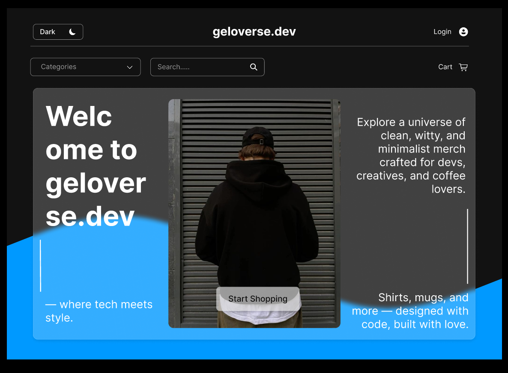

# Merchandise Online Shop 🛒
A simple **PHP-based online merchandise shop** featuring category filtering, responsive product grid layout, and dynamic product management.  

This project is **not hosted online** — it is designed to be run locally using Laragon with PHP and MySQL.  

---

## 🚀 Features
- **Category Filtering** – Browse products by Apparel, Drinkware, or Accessories.  
- **Responsive Layout** – Product grid adapts using CSS Grid & Flexbox.  
- **Database-driven Content** – Product image paths stored in MySQL (no BLOBs).  
- **Shopping Actions** – Add-to-Cart & Buy Now button structure (front-end ready).  
- **Password Recovery** – Secure tokenized email reset with PHPMailer (SMTP).  
- **Scalable Structure** – Organized folders for real-world deployment.  
- **Product Management** – Supports manual uploads & database content handling.  

---

## 🛠 Tech Stack
- **Frontend:** HTML, CSS (Grid/Flexbox)  
- **Backend:** PHP  
- **Database:** MySQL  
- **Email Service:** PHPMailer (SMTP for password reset)  

---

## ⚙️ Local Setup (LARAGON)
1. Download or clone this repo.
   
   ```bash
   git clone https://github.com/itsme-angeloo/merchandise-onlineshop.git
